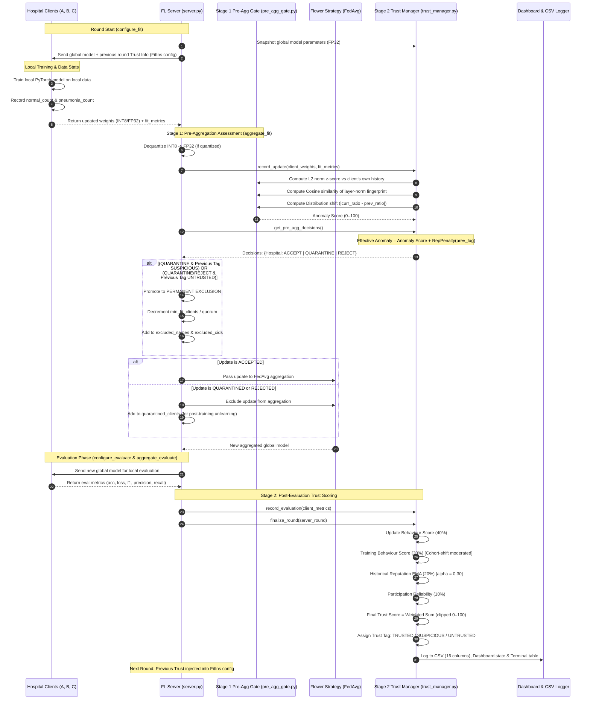

# 🛡️ Client Trust Scoring, Anomaly Detection & Gating System

> **Source Files:** [`src/trust_manager.py`](file:///c:/Users/Public/Documents/Major%20Project/Federated-Learning/federated_healthcare/src/trust_manager.py) · [`src/pre_agg_gate.py`](file:///c:/Users/Public/Documents/Major%20Project/Federated-Learning/federated_healthcare/src/pre_agg_gate.py) · [`src/server.py`](file:///c:/Users/Public/Documents/Major%20Project/Federated-Learning/federated_healthcare/src/server.py)
>
> 📊 **Visual Workflow Poster:** An interactive, printable technical poster is available at [`TRUST_WORKFLOW_POSTER.html`](file:///c:/Users/Public/Documents/Major%20Project/Federated-Learning/federated_healthcare/TRUST_WORKFLOW_POSTER.html).
>
> A Non-IID-safe, two-stage trust evaluation and gating system built for Federated Healthcare AI. It operates strictly on the **server side**, detects anomalous weight updates and metric anomalies, gates updates before model aggregation (`ACCEPT` / `QUARANTINE` / `REJECT`), maintains long-term reputation tracking (`TRUSTED` / `SUSPICIOUS` / `UNTRUSTED`), enforces persistent exclusion for compromised clients, and connects quarantined clients to DACM / post-training unlearning.

---

## Table of Contents

1. [System Overview & Architecture](#1-system-overview--architecture)
2. [End-to-End Workflow Diagrams](#2-end-to-end-workflow-diagrams)
   - [Mermaid Sequence & Decision Flowchart](#mermaid-sequence--decision-flowchart)
   - [Round Lifecycle Flow](#round-lifecycle-flow)
3. [Stage 1: Pre-Aggregation Anomaly Gate](#3-stage-1-pre-aggregation-anomaly-gate)
   - [L2 Update Norm Anomaly (0–50)](#31-l2-update-norm-anomaly-050)
   - [Layer-Norm Fingerprint & Cosine Similarity (0–30)](#32-layer-norm-fingerprint--cosine-similarity-030)
   - [Class Distribution Tracking & Shift Context](#33-class-distribution-tracking--shift-context)
   - [Training Metric Anomaly (0–20)](#34-training-metric-anomaly-020)
   - [Reputation Feedback & Gating Decisions](#35-reputation-feedback--gating-decisions)
4. [Stage 2: Post-Evaluation Trust Scoring & Tagging](#4-stage-2-post-evaluation-trust-scoring--tagging)
   - [The Four Trust Components](#41-the-four-trust-components)
   - [Trust Score Formula & Weights](#42-trust-score-formula--weights)
   - [Trust Tag Thresholds](#43-trust-tag-thresholds)
5. [Persistent Exclusion & Dynamic Quorum](#5-persistent-exclusion--dynamic-quorum)
6. [Non-IID Safety Guarantees](#6-non-iid-safety-guarantees)
7. [Configuration Reference](#7-configuration-reference)
8. [Logging, Dashboards & Client Feedback](#8-logging-dashboards--client-feedback)
9. [Detailed Real-World Case Studies](#9-detailed-real-world-case-studies)
   - [Case 1: Benign Hospital with Cohort Shift (Non-IID Protection)](#case-1-benign-hospital-with-cohort-shift-non-iid-protection)
   - [Case 2: Sudden Model Poisoning / Weight Manipulation Attack](#case-2-sudden-model-poisoning--weight-manipulation-attack)
   - [Case 3: Recurring Anomalous Client & Persistent Exclusion](#case-3-recurring-anomalous-client--persistent-exclusion)
   - [Case 4: Severe Compromise (UNTRUSTED + REJECT / QUARANTINE -> Permanent Exclusion)](#case-4-severe-compromise-untrusted--reject--quarantine--permanent-exclusion)
10. [Key Design Principles](#10-key-design-principles)

---

## 1. System Overview & Architecture

In a federated healthcare network, hospitals train locally on sensitive patient chest X-rays (e.g., Pneumonia vs. Normal). Because patient demographics and hospital specialties differ, data is inherently **Non-IID**.

The Trust System addresses two fundamental questions every round:
1. **Pre-Aggregation (Safety):** *"Is this hospital's model update safe to blend into the global model right now, or will it corrupt patient diagnostics?"*
2. **Post-Evaluation (Reputation):** *"What is this hospital's overall long-term reliability and behavioural standing across rounds?"*

### Two-Stage Separation of Concerns

```
                     ┌─────────────────────────────────────────────────────────┐
                     │              TWO-STAGE TRUST ARCHITECTURE               │
                     └─────────────────────────────────────────────────────────┘
                                                  │
            ┌─────────────────────────────────────┴─────────────────────────────────────┐
            ▼                                                                           ▼
┌───────────────────────────────────────┐                   ┌───────────────────────────────────────┐
│  STAGE 1: PRE-AGGREGATION GATE        │                   │  STAGE 2: POST-EVALUATION TRUST       │
│  (pre_agg_gate.py)                    │                   │  (trust_manager.py)                   │
├───────────────────────────────────────┤                   ├───────────────────────────────────────┤
│ • Evaluated BEFORE FedAvg             │                   │ • Evaluated AFTER evaluation metrics  │
│ • Fast, current-round anomaly check   │                   │ • Slow, EMA-smoothed reputation       │
│ • Uses: L2 norm, Cosine similarity,   │                   │ • Uses: 4 component scores (Update,   │
│   distribution shift context          │                   │   Training, History, Reliability)     │
│ • Modulated by previous Trust Tag     │                   │ • Modulated by cohort shift context   │
│ • Output: ACCEPT / QUARANTINE / REJECT│                   │ • Output: TRUSTED/SUSPICIOUS/UNTRUSTED│
│ • Impact: Gates entry into FedAvg     │                   │ • Impact: Rep penalty in next round   │
└───────────────────────────────────────┘                   └───────────────────────────────────────┘
```

### Tag and Decision Mapping

| Stage | Metric / Tag | Level | Meaning | Impact on System |
|---|---|---|---|---|
| **Stage 1 (Pre-Agg)** | `ACCEPT` | Normal | Update conforms to client baseline | Update enters FedAvg aggregation |
| **Stage 1 (Pre-Agg)** | `QUARANTINE` | Warning | Single strong anomaly or repeat offender | Excluded from FedAvg; queued for unlearning |
| **Stage 1 (Pre-Agg)** | `REJECT` | Severe | Multi-signal attack or severe divergence | Excluded immediately from aggregation |
| **Stage 2 (Post-Eval)** | 🟢 `TRUSTED` | Score $\ge 80.0$ | Consistent, dependable client | No reputation penalty in next round |
| **Stage 2 (Post-Eval)** | 🟡 `SUSPICIOUS` | Score $50.0 - 79.9$ | Notable degradation or variance | Adds $+20$ reputation penalty in next round gate |
| **Stage 2 (Post-Eval)** | 🔴 `UNTRUSTED` | Score $< 50.0$ | Severe degradation across rounds | Adds $+40$ reputation penalty in next round gate |

> [!NOTE]
> **Trust Score $\neq$ FedAvg Weight:** FedAvg continues to use standard sample-count-based weighting for all **ACCEPTED** clients. The Trust System determines **admissibility** (`ACCEPT` vs `QUARANTINE` vs `REJECT`), rather than modifying FedAvg math.

---

## 2. End-to-End Workflow Diagrams

### Mermaid Sequence & Decision Flowchart



### Round Lifecycle Flow

```
 ROUND N LIFECYCLE
 ─────────────────
 [1] configure_fit()
     ├── tm.set_global_params(global_weights)       <- Baseline for L2 & Cosine fingerprint
     └── Inject previous round trust info:
         ├── trust_score, trust_tag, component scores
         └── anomaly_score, pre_agg_decision, aggregation_decision
     │
 [2] CLIENT LOCAL TRAINING
     └── Hospitals train locally; report normal_count and pneumonia_count
     │
 [3] aggregate_fit() [STAGE 1 PRE-AGGREGATION GATE]
     ├── Dequantize INT8 -> FP32 (ensures uniform L2 scale)
     ├── tm.record_update(client_name, fp32_weights, cid, fit_metrics):
     │   ├── Compute L2 norm: ||W_client - W_global||_2
     │   ├── Compute layer-norm fingerprint & cosine similarity to previous update
     │   ├── Compute class distribution shift: |Pneu_ratio_curr - Pneu_ratio_prev|
     │   └── Compute Stage 1 Anomaly Score (0–100)
     ├── tm.get_pre_agg_decisions():
     │   ├── Add Reputation Penalty: TRUSTED (+0) | SUSPICIOUS (+20) | UNTRUSTED (+40)
     │   └── Gating Decision:
     │       ├── Effective Anomaly < 40  → ✅ ACCEPT   (enters FedAvg)
     │       ├── Effective Anomaly >= 40 → 🔶 QUARANTINE (excluded from FedAvg)
     │       └── Effective Anomaly >= 70 → ❌ REJECT     (excluded from FedAvg)
     ├── Persistent Exclusion Check (_check_promote_to_excluded):
     │   ├── Rule 1: QUARANTINE + previous tag was SUSPICIOUS
     │   ├── Rule 2: QUARANTINE or REJECT + previous tag was UNTRUSTED
     │   └── If triggered: Add to excluded_names & excluded_cids, adjust Flower quorum immediately
     └── Fallback Protection:
         └── If ALL clients quarantined/rejected → Fall back to ACCEPT all to prevent crash
     │
 [4] evaluate_metrics_aggregation_fn() [STAGE 2 TRUST SCORING]
     ├── tm.record_evaluation(name, acc, loss, f1, precision, recall)
     │   └── Refine stored anomaly score with actual evaluation metrics
     ├── tm.finalize_round(round_number):
     │   ├── Compute 4 component scores:
     │   │   ├── Update Score (40%)        <- z-score vs own L2 history
     │   │   ├── Training Score (30%)      <- trend vs own history, shift-moderated
     │   │   ├── Historical Trust (20%)    <- EMA smoothing (alpha = 0.30)
     │   │   └── Participation Score (10%) <- successful rounds / total rounds
     │   ├── Calculate blended Trust Score & map to Tag (🟢 / 🟡 / 🔴)
     │   ├── Map to post-eval Aggregation Decision (ACCEPT / QUARANTINE / REJECT)
     │   ├── Append current norm, acc, loss, dist to client history
     │   └── Output: Extended CSV, Terminal Table, Dashboard State
     │
 [5] POST-TRAINING COMPLETION
     └── If any client was in quarantined_clients:
         └── Auto-trigger DACM post-training unlearning pipeline (run_unlearn_workflow)
```

---

## 3. Stage 1: Pre-Aggregation Anomaly Gate

The Pre-Aggregation Gate (`src/pre_agg_gate.py`) evaluates updates before they touch the global model.

$$\text{AnomalyScore} = \text{L2\_contrib} (0\text{--}50) + \text{Cosine\_contrib} (0\text{--}30) + \text{Training\_contrib} (0\text{--}20)$$

### 3.1 L2 Update Norm Anomaly (0–50)

Measures Euclidean distance between client update and global parameters:
$$\| \Delta W \|_2 = \sqrt{\sum_i (W_{\text{client}, i} - W_{\text{global}, i})^2}$$

Once a client has $\ge 3$ rounds of history, its z-score against its **own historical update norms** is calculated:
$$z = \frac{\| \Delta W \|_2 - \mu_{\text{history}}}{\sigma_{\text{history}}}$$

The L2 anomaly contribution is mapped piece-wise:

| z-score Range | Update Size Behaviour | L2 Contribution (0–50) |
|---|---|---|
| $z \le 0$ | Below historical mean (healthy) | $0.0$ |
| $0 < z \le 1$ | Up to 1 std dev above mean | $z \times 8.0$ |
| $1 < z \le 2$ | 1 to 2 std devs above mean | $8.0 + (z - 1.0) \times 14.0$ |
| $2 < z \le 3$ | 2 to 3 std devs above mean (suspicious) | $22.0 + (z - 2.0) \times 18.0$ |
| $z > 3$ | Extreme outlier ($> 3$ std devs) | $\min(50.0, 40.0 + (z - 3.0) \times 5.0)$ |

*Edge Case:* If $\sigma \approx 0$ (ultra-stable client), the ratio $\| \Delta W \|_2 / \mu$ is used ($<2\times \to 0$, $2\text{--}3\times \to 15$, $3\text{--}5\times \to 30$, $>5\times \to 45$).

### 3.2 Layer-Norm Fingerprint & Cosine Similarity (0–30)

Full weight deltas across millions of parameters consume 100+ MB per client per round. To make cosine similarity lightweight and memory-efficient, the server computes a **layer-norm fingerprint vector**:

$$\mathbf{v}_{\text{fingerprint}} = \left[ \|\Delta W_{\text{layer } 1}\|_2, \|\Delta W_{\text{layer } 2}\|_2, \dots, \|\Delta W_{\text{layer } L}\|_2 \right]$$

Cosine similarity is computed against the client's **own previous layer-norm fingerprint**:
$$\text{CosineSim} = \frac{\mathbf{v}_{\text{curr}} \cdot \mathbf{v}_{\text{prev}}}{\|\mathbf{v}_{\text{curr}}\|_2 \|\mathbf{v}_{\text{prev}}\|_2} \in [-1.0, 1.0]$$

| Cosine Similarity | Angular Deviation | Cosine Contribution (0–30) |
|---|---|---|
| $\ge 0.5$ | Consistent update energy distribution across layers | $0.0$ |
| $0.0 \le \text{Cosine} < 0.5$ | Slight redistribution of layer energy | $\frac{0.5 - \text{Cosine}}{0.5} \times 10.0$ |
| $-0.5 \le \text{Cosine} < 0.0$ | Major redistribution across layers | $10.0 + \frac{-\text{Cosine}}{0.5} \times 15.0$ |
| $\text{Cosine} < -0.5$ | Complete directional inversion (suspicious) | $25.0 + (-\text{Cosine} - 0.5) \times 10.0$ |

*Warmup:* Returns $0.0$ during the first 2 rounds until baseline fingerprints exist.

### 3.3 Class Distribution Tracking & Shift Context

In healthcare, each hospital's cohort can change between rounds (e.g., admitting an influx of pneumonia patients). Clients report `normal_count` and `pneumonia_count` in their metrics:

$$\text{Pneumonia Ratio} = \frac{\text{pneumonia\_count}}{\text{normal\_count} + \text{pneumonia\_count}}$$
$$\text{Distribution Shift} = |\text{Pneumonia Ratio}_{\text{curr}} - \text{Pneumonia Ratio}_{\text{prev}}| \in [0.0, 1.0]$$

> [!IMPORTANT]
> **Distribution Shift is Context, Not Evidence:**
> A large shift indicates legitimate Non-IID cohort variation. It **moderates (reduces)** training anomaly penalties so honest hospitals are not flagged. It never triggers a quarantine on its own!

### 3.4 Training Metric Anomaly (0–20)

Before evaluation metrics are available at gate time, this contribution is $0.0$. When evaluation occurs, it is refined based on accuracy drops ($\Delta \text{Acc} = \text{Acc}_{\text{curr}} - \text{Acc}_{\text{prev}}$) and loss spikes ($\Delta \text{Loss} = \text{Loss}_{\text{curr}} - \text{Loss}_{\text{prev}}$):

- **Accuracy Penalties:** $\Delta \text{Acc} < -0.20 \implies +15.0$; $\Delta \text{Acc} < -0.10 \implies +8.0$; $\Delta \text{Acc} < -0.05 \implies +3.0$
- **Loss Penalties:** $\Delta \text{Loss} > 1.0 \implies +5.0$; $\Delta \text{Loss} > 0.5 \implies +3.0$; $\Delta \text{Loss} > 0.2 \implies +1.0$
- **Distribution Shift Moderation:**
  - If $\text{Shift} > 0.40$ (`dist_shift_high`): up to **80% reduction** in training anomaly penalty.
  - If $0.20 < \text{Shift} \le 0.40$ (`dist_shift_medium`): up to **40% reduction**.

### 3.5 Reputation Feedback & Gating Decisions

When the server runs `get_pre_agg_decisions()`, it takes the raw Anomaly Score and applies **reputation pressure** based on the client's previous Trust Tag:

$$\text{Effective Anomaly} = \min\left(100.0, \; \text{Anomaly Score} + \text{Reputation Penalty}\right)$$

| Previous Round Trust Tag | Reputation Penalty | Effect on Gate |
|---|---|---|
| 🟢 `TRUSTED` | $+0$ | Normal gate thresholds |
| 🟡 `SUSPICIOUS` | $+20$ | Stricter gate; moderate anomaly triggers quarantine |
| 🔴 `UNTRUSTED` | $+40$ | Near-auto quarantine; client must be completely clean |

**Decision Thresholds:**
- $\text{Effective Anomaly} \ge 70.0 \implies \mathbf{REJECT}$ (Update discarded from aggregation)
- $\text{Effective Anomaly} \ge 40.0 \implies \mathbf{QUARANTINE}$ (Update discarded from aggregation; flagged for unlearning)
- $\text{Effective Anomaly} < 40.0 \implies \mathbf{ACCEPT}$ (Update included in FedAvg)

---

## 4. Stage 2: Post-Evaluation Trust Scoring & Tagging

After the new global model is evaluated across all hospitals, `finalize_round()` executes Stage 2.

### 4.1 The Four Trust Components

#### 1. Update Behaviour Score (Weight: 40%)
Evaluates whether update magnitude is normal for that client using z-score:
- $z \le 0 \implies 90.0$ (healthy, smaller than average update)
- $0 < z \le 1 \implies 90.0 - 10.0 \times z$ ($80\text{--}90$)
- $1 < z \le 2 \implies 80.0 - 15.0 \times (z - 1.0)$ ($65\text{--}80$)
- $2 < z \le 3 \implies 65.0 - 25.0 \times (z - 2.0)$ ($40\text{--}65$)
- $z > 3 \implies \max(10.0, \; 40.0 - 10.0 \times (z - 3.0))$

#### 2. Training Behaviour Score (Weight: 30%)
Evaluates accuracy/loss trends relative to the client's **own previous round**:
- Base score: $85.0$
- Accuracy drop penalties: $>20\% \implies -30$; $10\text{--}20\% \implies -15$; $5\text{--}10\% \implies -5$
- Loss increase penalties: $>1.0 \implies -20$; $0.5\text{--}1.0 \implies -10$; $0.2\text{--}0.5 \implies -5$
- **Cohort Shift Moderation:** If $\text{Distribution Shift} > 0.20$, penalty is moderated by up to $50\%$:
  $$\text{Moderation} = 0.50 \times \min\left(\frac{\text{Shift} - 0.20}{0.30}, \; 1.0\right)$$
  $$\text{Penalty}_{\text{final}} = \text{Penalty} \times (1.0 - \text{Moderation})$$
- Improvement reward: $\Delta \text{Acc} > 5\% \implies +10$; $\Delta \text{Acc} > 0\% \implies +5$
- Sanity floor check: If $\text{Accuracy} < 30\%$, deduct $-20$.

#### 3. Historical Reputation Score (Weight: 20%)
Exponential Moving Average (EMA) preserving behavioral memory across rounds:
$$\text{Hist}_{\text{new}} = (1 - \alpha) \times \text{Hist}_{\text{old}} + \alpha \times \text{TrustScore}_{\text{curr}}$$
Where $\alpha = 0.30$. Starts at **$82.0$** so new clients begin as trusted.

#### 4. Participation Reliability Score (Weight: 10%)
$$\text{Participation Score} = \left(\frac{\text{Successful Rounds}}{\text{Total Rounds Selected}}\right) \times 100$$

### 4.2 Trust Score Formula & Weights

$$\begin{aligned}
\text{Trust Score} = &\; 0.40 \times \text{Update Behaviour Score} \\
&+\; 0.30 \times \text{Training Behaviour Score} \\
&+\; 0.20 \times \text{Historical Reputation Score} \\
&+\; 0.10 \times \text{Participation Reliability Score}
\end{aligned}$$
*(Clipped to $[0.0, 100.0]$)*

### 4.3 Trust Tag Thresholds

```python
TRUST_CONFIG["thresholds"] = {
    "TRUSTED":    80.0,   # Score >= 80.0 -> 🟢 TRUSTED
    "SUSPICIOUS": 50.0,   # Score >= 50.0 -> 🟡 SUSPICIOUS
}                         # Score <  50.0 -> 🔴 UNTRUSTED
```

Post-Evaluation Aggregation Decision Mapping:
- `TRUSTED` $\implies$ `ACCEPT`
- `SUSPICIOUS` $\implies$ `QUARANTINE`
- `UNTRUSTED` $\implies$ `REJECT`

---

## 5. Persistent Exclusion & Dynamic Quorum

When anomalous behavior persists or severe compromise is confirmed, the system enforces permanent isolation:

```mermaid
flowchart TD
    A[Client Decision in Stage 1] --> B{Gating Decision?}
    B -- ACCEPT --> C[Enters FedAvg Aggregation]
    B -- QUARANTINE --> D{Previous Round Trust Tag?}
    B -- REJECT --> E{Previous Round Trust Tag?}
    
    D -- TRUSTED --> F[Temporary Quarantine: Excluded this round only]
    F --> G[Add to strategy.quarantined_clients for post-training unlearning]
    
    D -- SUSPICIOUS --> H[Promote to PERMANENT EXCLUSION (Rule 1)]
    D -- UNTRUSTED --> H[Promote to PERMANENT EXCLUSION (Rule 2)]
    
    E -- TRUSTED / SUSPICIOUS --> I[Temporary Reject: Excluded this round]
    E -- UNTRUSTED --> H[Promote to PERMANENT EXCLUSION (Rule 2)]
    
    H --> J[Add to excluded_names & excluded_cids]
    H --> K[Trigger _reduce_quorum_for_exclusions: min_fit & min_available adjusted]
    H --> L[Unregister proxy from Flower client_manager: blocked from future fit/eval]
    H --> M[Reconnection protection: new CIDs from same client dropped]
    H --> N[Included in targets_to_unlearn for post-training DACM unlearning]
```

### Two-Strike Permanent Exclusion Rules

| Rule | Previous Round Trust Tag | Current Round Pre-Agg Decision | Action Taken |
|---|---|---|---|
| **Rule 1** | 🟡 `SUSPICIOUS` | 🔶 `QUARANTINE` | **PERMANENT EXCLUSION** + Quorum Reduction + Scheduled for DACM Unlearning |
| **Rule 2a** | 🔴 `UNTRUSTED` | 🔶 `QUARANTINE` | **PERMANENT EXCLUSION** + Quorum Reduction + Scheduled for DACM Unlearning |
| **Rule 2b** | 🔴 `UNTRUSTED` | ❌ `REJECT` | **PERMANENT EXCLUSION** + Quorum Reduction + Scheduled for DACM Unlearning |
| *Baseline* | 🔴 `UNTRUSTED` | ✅ `ACCEPT` | Retains `+40` reputation penalty in next round; not permanently excluded |

1. **Dynamic Detection:** Handled by `_check_promote_to_excluded(quarantined_names, excluded_names, rejected_names)` in `server.py`. No hospital names are hardcoded; clients are evaluated dynamically from runtime trust states.
2. **Total Participation Blacklist:**
   - **No Future FIT:** Excluded client CIDs are unregistered from Flower's `client_manager` before sampling and filtered from `configure_fit()`.
   - **No Future EVALUATE:** Filtered out and unregistered before `configure_evaluate()`.
   - **Reconnection Protection:** If an excluded client reconnects with a fresh CID, the server matches its `client_name`, binds the new CID to `excluded_cids`, and immediately discards its update before aggregation.
3. **Dynamic Quorum Adjustment:** If a 3-hospital network permanently excludes 1 hospital, Flower would normally deadlock waiting for 3 clients. `_reduce_quorum_for_exclusions()` automatically recalculates:
   $$\text{new\_target} = \max(1, \text{initial\_target} - n_{\text{excluded}})$$
   $$\text{new\_min} = \max(1, \text{new\_target} - 1)$$
   updating `min_fit_clients`, `min_evaluate_clients`, and `min_available_clients` so the healthy hospitals continue training seamlessly.
4. **Post-Training Federated Unlearning (FU) + DACM Recovery:**
   - Excluded clients are preserved in `targets_to_unlearn = quarantined_clients | excluded_names`.
   - At training completion, `run_unlearn_workflow()` performs gradient-ascent unlearning on the excluded client's historical data, audits class distribution imbalance among surviving hospitals, and executes federated DACM recovery with loss weighting strictly on the surviving hospitals.
   - The recovered global model artifact (`dacm_recovered_<Target>_<suffix>.pth`) is saved and registered in `all_global_models_registry.csv` associated exclusively with surviving hospitals.

---

## 6. Non-IID Safety Guarantees

In medical imaging, cross-client comparison creates massive false positives. The Trust System guarantees Non-IID safety through four mechanisms:

| Mechanism | How Non-IID Fairness is Ensured |
|---|---|
| **Self-Referential Z-Scores** | Update L2 norm is compared against the **same client's own history**, not against other hospitals. |
| **Self-Referential Training Deltas** | Accuracy changes are calculated relative to that hospital's previous round ($\text{Acc}_{\text{curr}} - \text{Acc}_{\text{prev}}$), not against the global average. |
| **Cohort Shift Moderation** | Large swings in normal vs. pneumonia patient ratios explicitly reduce metric anomaly penalties by up to 50%–80%. |
| **Generous Starting Reputation (82.0)** | New hospitals begin with an 82.0 neutral rating ($\ge 80$ threshold), ensuring innocent-until-proven-guilty onboarding. |

---

## 7. Configuration Reference

### `src/trust_manager.py` (`TRUST_CONFIG`)

```python
TRUST_CONFIG = {
    "weights": {
        "update_behaviour":          0.40,
        "training_behaviour":        0.30,
        "historical_reputation":     0.20,
        "participation_reliability": 0.10,
    },
    "thresholds": {
        "TRUSTED":    80.0,
        "SUSPICIOUS": 50.0,
    },
    "historical_ema_alpha":               0.30,  # 30% weight to current round
    "min_history_for_anomaly":            3,     # Warmup rounds for z-score
    "neutral_score":                      82.0,  # Neutral baseline
    "initial_historical_trust":           82.0,  # Starting trust for new clients
    "training_dist_moderation_threshold": 0.20,  # Shift threshold to activate moderation
    "training_dist_moderation_max":       0.50,  # Max 50% reduction in penalty
}
```

### `src/pre_agg_gate.py` (`PRE_AGG_CONFIG`)

```python
PRE_AGG_CONFIG = {
    "quarantine_threshold":        40.0,  # Effective anomaly >= 40 -> QUARANTINE
    "reject_threshold":            70.0,  # Effective anomaly >= 70 -> REJECT
    "min_history_for_cosine":      2,     # Rounds needed before cosine check
    "cosine_suspicious_threshold": 0.0,   # Cosine < 0 starts penalty
    "dist_shift_high":             0.40,  # Shift > 0.40 -> strong moderation
    "dist_shift_medium":           0.20,  # Shift > 0.20 -> partial moderation
    "dist_shift_max_moderation":   0.80,  # Up to 80% reduction of training anomaly
    "min_history_for_l2":          3,     # Rounds needed before L2 anomaly
}
```

---

## 8. Logging, Dashboards & Client Feedback

### Extended CSV Log Schema

Written to `dashboard/results/<suffix>/trust_<suffix>.csv` (16 columns):

```csv
Round,Client,UpdateScore,TrainingScore,HistoricalScore,ReliabilityScore,TrustScore,Tag,L2Norm,CosineSimilarity,DistributionShift,AnomalyScore,PreAggregationDecision,AggregationDecision,NormalCount,PneumoniaCount
```

### Terminal Table (Printed Every Round)

```
================================================================================
                     CLIENT TRUST STATUS -- Round 5
================================================================================
Client              Update  Training  History   Reliab    SCORE   TAG          ANOMALY  PRE-AGG
--------------------------------------------------------------------------------
Hospital_A            90.0      95.0     84.2    100.0     91.8   TRUSTED          4.2  ACCEPT
Hospital_B            84.5      80.0     83.1    100.0     82.7   TRUSTED          6.5  ACCEPT
Hospital_C            35.0      50.0     68.5    100.0     49.2   UNTRUSTED       74.8  REJECT
================================================================================
```

### Server-Side Isolation Guarantee (Hospital Terminal Privacy)

Trust scoring, anomaly detection, gating decisions, and reputation tracking are strictly **SERVER-SIDE ONLY**.

```
[SERVER TERMINAL / DASHBOARD / CSV]             [HOSPITAL CLIENT TERMINALS]
• Full 4-Component Trust Scores                 • Receives standard FL training configs
• ACCEPT / QUARANTINE / REJECT Decisions         • Sees ONLY local training & evaluation
• Anomaly & Cosine Scores, Reputation           • NO Trust Tags or Scores displayed
• Complete Audit Trail & Dashboards             • Complete privacy across federation
```

Hospital/client terminals do **NOT** receive or display:
- `TRUSTED` / `SUSPICIOUS` / `UNTRUSTED` tags
- Numerical trust scores or component breakdowns
- Anomaly scores, cosine similarities, or distribution shifts
- Pre-aggregation decisions (`ACCEPT`, `QUARANTINE`, `REJECT`)
- Reputation penalties or persistent exclusion statuses

The client receives only genuine operational parameters required for training (`server_round`, `pneumonia_weight` for loss scaling). Internal trust and security data remain strictly confidential to the server administrator.

---

## 9. Detailed Real-World Case Studies

### Case 1: Benign Hospital with Cohort Shift (Non-IID Protection)

**Scenario:** In Round 6, Hospital B experiences a demographic shift in its incoming patient cohort. The proportion of pneumonia cases changes dramatically from 70% to 30%. Because the validation set distribution shifted, its local accuracy drops from 82.0% to 74.0% ($\Delta \text{Acc} = -8.0\%$).

```
Hospital B Data:
- Previous: Normal = 300, Pneumonia = 700 (Ratio = 0.70)
- Current : Normal = 700, Pneumonia = 300 (Ratio = 0.30)
- Distribution Shift = |0.30 - 0.70| = 0.40 (High)
- Update L2 Norm = 1.42 (vs own history mean = 1.38, std = 0.10 -> z = 0.40)
- Cosine Similarity = 0.952 (Layer-norm fingerprint aligns with past updates)
```

**Step-by-step Evaluation:**
1. **Stage 1 Pre-Aggregation Gate:**
   - L2 contribution: $z = 0.40 \implies 0.40 \times 8.0 = 3.2$
   - Cosine contribution: $\text{Cosine} = 0.952 \ge 0.5 \implies 0.0$
   - Training contribution: Pre-eval gate $= 0.0$
   - Previous Tag: `TRUSTED` $\implies \text{Reputation Penalty} = +0$
   - $\text{Effective Anomaly} = 3.2 < 40.0 \implies \mathbf{ACCEPT}$
   - Update successfully enters FedAvg!

2. **Stage 2 Post-Evaluation Trust Scoring:**
   - Update Behaviour Score: $z = 0.40 \implies 90.0 - (10.0 \times 0.40) = 86.0$
   - Training Behaviour Score:
     - Base penalty for 8% drop: $5.0$
     - Shift Moderation: $\text{Shift} = 0.40 \implies t = \frac{0.40 - 0.20}{0.30} = 0.667 \implies \text{Moderation} = 0.50 \times 0.667 = 33.3\%$
     - Moderated Penalty: $5.0 \times (1 - 0.333) = 3.33$
     - Training Score: $85.0 - 3.33 = 81.7$
   - Historical Trust: Prior EMA $= 83.5$
   - Participation: $100.0$
   - **Blended Trust Score:**
     $$0.40(86.0) + 0.30(81.7) + 0.20(83.5) + 0.10(100.0) = 34.4 + 24.51 + 16.7 + 10.0 = \mathbf{85.6}$$
   - **Result:** **🟢 TRUSTED** (Score $\ge 80.0$). Hospital B was protected from unfair penalties caused by natural patient variation!

---

### Case 2: Sudden Model Poisoning / Weight Manipulation Attack

**Scenario:** In Round 7, Hospital C is compromised. A malicious actor injects backdoored weights with huge gradient steps to derail the global pneumonia classifier.

```
Hospital C Data:
- Current Update L2 Norm = 8.65 (vs own history mean = 1.50, std = 0.12 -> z = 59.5)
- Layer-norm fingerprint inverted: Cosine Similarity = -0.68
- Distribution Shift = 0.02 (cohort is unchanged)
```

**Step-by-step Evaluation:**
1. **Stage 1 Pre-Aggregation Gate:**
   - L2 contribution: $z = 59.5 > 3.0 \implies \min(50.0, 40.0 + (59.5 - 3.0) \times 5.0) = 50.0$ (Maxed out)
   - Cosine contribution: $\text{Cosine} = -0.68 < -0.5 \implies 25.0 + (-(-0.68) - 0.5) \times 10.0 = 26.8$
   - Raw Anomaly Score: $50.0 + 26.8 = \mathbf{76.8}$
   - Gate Threshold Check: $\text{Effective Anomaly} = 76.8 \ge 70.0 \implies \mathbf{REJECT}$
   - **Action Taken:** Hospital C's update is **immediately dropped** before calling FedAvg. The global model is completely insulated from poisoned weights!

2. **Stage 2 Post-Evaluation Trust Scoring:**
   - Update Behaviour Score: $z > 3.0 \implies \max(10.0, 40.0 - 10.0(59.5 - 3.0)) = 10.0$
   - Training Behaviour Score: Accuracy collapsed to 22.0% ($< 30\% \implies -20$), Score $= 30.0$
   - Historical Reputation: Old EMA $= 78.0 \implies (0.7 \times 78.0) + (0.3 \times 25.0) = 62.1$
   - Participation: $100.0$
   - **Blended Trust Score:**
     $$0.40(10.0) + 0.30(30.0) + 0.20(62.1) + 0.10(100.0) = 4.0 + 9.0 + 12.42 + 10.0 = \mathbf{35.4}$$
   - **Result:** **🔴 UNTRUSTED** (Score $< 50.0$). Hospital C will carry a $+40$ penalty into Round 8.

---

### Case 3: Recurring Anomalous Client & Persistent Exclusion

**Scenario:** Hospital A suffers from severe intermittent hardware sensor failures and data corruption.
- In **Round 3**, its updates diverge; its Trust Score drops to $64.2 \implies$ **🟡 SUSPICIOUS**.
- In **Round 4**, it attempts to participate again with anomalous updates.

```
Round 4 Hospital A Data:
- Previous Trust Tag: SUSPICIOUS (Reputation Penalty = +20)
- Update L2 Norm z-score: z = 2.45
- Cosine Similarity: 0.15
- Distribution Shift: 0.05
```

**Step-by-step Evaluation:**
1. **Stage 1 Pre-Aggregation Gate:**
   - L2 contribution: $z = 2.45 \implies 22.0 + (2.45 - 2.0) \times 18.0 = 30.1$
   - Cosine contribution: $\text{Cosine} = 0.15 \implies \frac{0.5 - 0.15}{0.5} \times 10.0 = 7.0$
   - Raw Anomaly Score: $30.1 + 7.0 = 37.1$
   - *Without reputation penalty, $37.1 < 40$ would have been accepted!*
   - **Applying Reputation Feedback:**
     $$\text{Effective Anomaly} = 37.1 + 20.0 (\text{SUSPICIOUS Penalty}) = \mathbf{57.1}$$
   - Gate Decision: $57.1 \ge 40.0 \implies \mathbf{QUARANTINE}$
   - Update is blocked from entering FedAvg!

2. **Persistent Exclusion Check (`_check_promote_to_excluded`):**
   - Server observes: Hospital A was **QUARANTINED** this round AND carried a **SUSPICIOUS** tag from Round 3.
   - **Action:** Promoted to **PERMANENT EXCLUSION**!
   - Console alert:
     ```
     [EXCL] Hospital_A -> PERMANENTLY EXCLUDED (QUARANTINE + SUSPICIOUS tag).
     Will not be selected for training or evaluation in any subsequent round.
     ```
   - Flower Quorum Adjustment: `min_fit_clients` reduced from $3 \to 2$ to allow Hospital B and Hospital C to continue unimpeded.
   - Hospital A is scheduled for post-training unlearning via `strategy.quarantined_clients`.

---

### Case 4: Severe Compromise (UNTRUSTED + REJECT / QUARANTINE -> Permanent Exclusion)

**Scenario:** In Round 4, Hospital B suffered acute data poisoning and failed evaluation across minority classes, dragging its Trust Score down to $32.4 \implies$ **🔴 UNTRUSTED** (Score $< 50.0$).
- Entering **Round 5**, Hospital B carries a **$+40.0$ Reputation Penalty**.
- In Round 5, Hospital B submits another divergent or poisoned update.

```
Round 5 Hospital B Data:
- Previous Trust Tag: UNTRUSTED (Reputation Penalty = +40.0)
- Update L2 Norm z-score: z = 3.80 (Raw Anomaly = 44.0)
- Cosine Similarity: -0.10 (Raw Anomaly = 12.0)
- Distribution Shift: 0.04
- Raw Stage 1 Anomaly Score: 44.0 + 12.0 = 56.0
```

**Step-by-step Evaluation:**
1. **Stage 1 Pre-Aggregation Gate:**
   - Raw Anomaly Score: $56.0$
   - Applying $+40.0$ reputation penalty:
     $$\text{Effective Anomaly} = 56.0 + 40.0 (\text{UNTRUSTED Penalty}) = \mathbf{96.0}$$
   - Gate Decision: $96.0 \ge 70.0 \implies \mathbf{REJECT}$ *(If Effective Anomaly was $40.0\text{--}69.9$, decision would be $\mathbf{QUARANTINE}$)*
   - Update is immediately purged before FedAvg!

2. **Persistent Exclusion Check (`_check_promote_to_excluded`):**
   - Server observes: Hospital B received **REJECT** (or **QUARANTINE**) AND carried an **UNTRUSTED** tag from Round 4.
   - **Action:** Promoted to **PERMANENT EXCLUSION** under Rule 2!
   - Console alert:
     ```
     [EXCL] Hospital_B -> PERMANENTLY EXCLUDED (REJECT + UNTRUSTED tag).
     Will not be selected for training or evaluation in any subsequent round.
     ```
   - Flower Quorum dynamically reduced: `min_fit_clients: 3 -> 2`, `min_available_clients: 2 -> 1`.
   - Hospital B proxy unregistered from Flower `client_manager`.
   - Reconnection guard activated: if Hospital B attempts to rejoin with a new CID, its update is dropped on sight.

3. **Post-Training Federated Unlearning (FU) & DACM Recovery:**
   - Hospital B is preserved in `targets_to_unlearn = quarantined_clients | excluded_names`.
   - Upon final round completion, `server.py` auto-triggers `run_unlearn_workflow(target="Hospital_B")`.
   - Historical contributions from Hospital B are erased via gradient ascent (`unlearned_Hospital_B_<suffix>.pth`).
   - DACM audits surviving class distribution across healthy hospitals (Hospital A & Hospital C), calculates minority class compensation weight, and trains local recovery models.
   - Genuine recovered model `dacm_recovered_Hospital_B_<suffix>.pth` is generated and logged in `all_global_models_registry.csv` associated exclusively with surviving hospitals.

---

## 10. Key Design Principles

| Design Decision | Implementation Details | Engineering Rationale |
|---|---|---|
| **Two-Stage Architecture** | Stage 1 (Pre-Agg Gate) + Stage 2 (Post-Eval Score) | Gating must protect aggregation immediately, while reputation needs post-eval context and EMA smoothing. |
| **Fail-Safe Try/Except Blocks** | All trust calls wrapped in exception boundaries | Monitoring overlays must never crash active clinical federated training sessions. |
| **Layer-Norm Cosine Fingerprints** | 1-D vector of layer norms rather than full weights | Provides angular anomaly detection while saving hundreds of megabytes of memory and network traffic. |
| **Contextual Cohort Modulation** | Class ratios used to discount metric drops | Prevents penalizing hospitals treating changing patient demographics (Non-IID realism). |
| **Reputation Feedback Loop** | Previous tag adds $+20 / +40$ penalty to gate | Bridges historical reputation with immediate gating, stopping recurring low-level poisoning. |
| **Automatic Quorum Reduction** | `_reduce_quorum_for_exclusions()` in strategy | Prevents server deadlock when bad actors are permanently kicked out. |
| **Dual-Trigger Permanent Exclusion** | `SUSPICIOUS + QUARANTINE` or `UNTRUSTED + QUARANTINE/REJECT` | Protects federation against both persistent drift and chronic/severe poisoning while maintaining Non-IID fairness. |
| **Reconnection Protection** | `client_name` matching on incoming updates | Prevents banned clients from circumventing exclusion by creating new Flower gRPC CIDs. |
| **Decoupled from FedAvg Weighting** | Sample counts govern weights; trust governs admission | Preserves statistical convergence properties of FedAvg for all accepted updates. |

---

*Verified against codebase: [`src/trust_manager.py`](file:///c:/Users/Public/Documents/Major%20Project/Federated-Learning/federated_healthcare/src/trust_manager.py), [`src/pre_agg_gate.py`](file:///c:/Users/Public/Documents/Major%20Project/Federated-Learning/federated_healthcare/src/pre_agg_gate.py), and [`src/server.py`](file:///c:/Users/Public/Documents/Major%20Project/Federated-Learning/federated_healthcare/src/server.py).*
